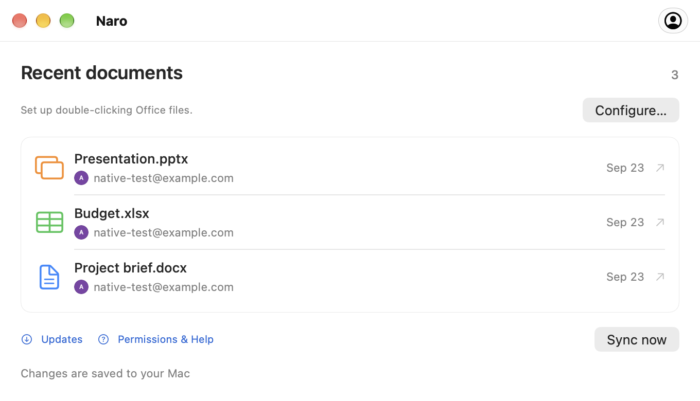

<p align="center">
  
</p>

<h1 align="center">Naro</h1>
<p align="center"><strong>Your files. Google’s editors. One double-click.</strong></p>
<p align="center">A native macOS app for opening Office files in Google Docs, Sheets, and Slides<br>and bringing saved changes back to your Mac.</p>
<p align="center"><a href="DEPLOY.md">Deploy to Netlify</a> · <a href="docs/guides.html">Guides</a> · <a href="docs/privacy.html">Privacy</a> · <a href="https://github.com/plexideas/naro-site/issues">Support</a></p>

> **[Download Naro](https://github.com/plexideas/naro/releases/latest)** · **[Website](https://naro.tools/)**. The current build targets Apple Silicon and macOS 26+. This repository contains the public information website and documentation; the application source is not included.

<p align="center"></p>

## From Finder to Google, and back

1. Connect a Google account and make Naro the default app for supported Office files.
2. Double-click a document in Finder. With multiple accounts, choose one in a compact avatar picker.
3. Edit in your browser. While Naro is running and online, Google’s saved changes return to your local file.

| Your file               | Opens in      | Extensions      |
| ----------------------- | ------------- | --------------- |
| Word document           | Google Docs   | `.doc`, `.docx` |
| Excel spreadsheet       | Google Sheets | `.xls`, `.xlsx` |
| PowerPoint presentation | Google Slides | `.ppt`, `.pptx` |

## Designed to stay out of the way

- Native macOS interface with Liquid Glass.
- Multiple Google accounts with profile photos and a compact account picker.
- Recent-document history, including the account used to open each file.
- Local backups and conflict handling that preserves both versions.
- No menu-bar icon. Open Naro itself to manage accounts and view history.
- Sign-in tokens stored in macOS Keychain. Documents move directly between your Mac and Google.

## Current limitations

- Editing and synchronization require an internet connection. Quitting Naro pauses synchronization.
- Files up to 100 MB are supported. Office compatibility depends on Google’s editors.
- Older Office files upgraded by Google are saved beside the original in the modern format.
- Converting an Office file into a separate Google-native document is not tracked by its original link.
- In-app updates download releases from GitHub and restart with user confirmation. Public Google OAuth verification is not claimed.
- The app and website support English, Russian, Simplified Chinese, Korean, Japanese, Spanish, German, Italian, and French. In the app, choose Naro → Language or follow macOS.

## Privacy and support

See the [privacy policy](docs/privacy.html) for account data, document storage, backups, and deletion instructions, and the [terms of use](docs/terms.html) for practical limitations.

For questions and feedback, [open an issue](https://github.com/plexideas/naro-site/issues). Issues are public: never attach credentials or private documents.

Naro is independently developed by [Sergei Sakharovskii (@plexideas)](https://github.com/plexideas). It is not affiliated with Google, Microsoft, or Apple.

## Deploy to Netlify

Import **[plexideas/naro-site](https://github.com/plexideas/naro-site)** into Netlify:

| Setting               | Value       |
| --------------------- | ----------- |
| Production branch     | `main`      |
| Base directory        | Leave empty |
| Build command         | From `netlify.toml` |
| Publish directory     | `docs`      |
| Environment variables | None        |

Netlify reads `netlify.toml` automatically. The existing project is `naro-app`, serving `naro.tools`. See [DEPLOY.md](DEPLOY.md) for publishing instructions in Russian.

## Website development

The site is static HTML and CSS with local language-selection and analytics scripts. Edit `templates/` and the nine JSON catalogs in `locales/`, then run `npm run build` to generate the 36 pages in `docs/`. Language links preserve the current page. Unprefixed URLs use the saved language preference or supported browser language; explicit language URLs stay as shared. Only a manual language choice is saved in local storage. Each edition includes matching screenshots. Netlify serves `docs/` from `main` and runs the configured checks during deployment. Analytics uses Netlify Functions and Blobs without an external analytics account or additional environment variables.

```sh
npm ci
npm run build
npm run check
npm test
npx netlify-cli dev --offline --dir docs
```

Open the local URL printed by Netlify. See [MAINTAINING.md](MAINTAINING.md) for publishing and Google verification preparation.

## Statistics

Open **[naro.tools/stats](https://naro.tools/stats)** to see daily visitors, visitors who clicked Download, and GitHub DMG/ZIP downloads by release. No additional account or setup is needed. Website data starts at the first visit after activation and covers the last 30 UTC days. GitHub counters cover all currently published releases, including downloads before activation.

Daily visitor counts are estimates; clicks do not prove completed downloads, and GitHub file download counts include repeats and updates. The dashboard itself sends no analytics. Only aggregate data is public. See [MAINTAINING.md](MAINTAINING.md#analytics) for definitions, retention and verification.

The repository contains public website materials only. No open-source license for the macOS application is granted here.
