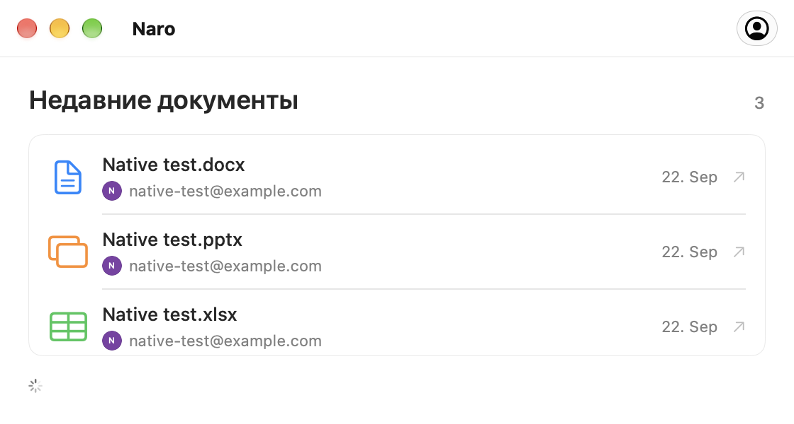

<p align="center">
  
</p>

<h1 align="center">Naro</h1>
<p align="center"><strong>Your files. Google’s editors. One double-click.</strong></p>
<p align="center">A native macOS app for opening Office files in Google Docs, Sheets, and Slides<br>and bringing saved changes back to your Mac.</p>
<p align="center"><a href="DEPLOY.md">Deploy to Netlify</a> · <a href="docs/guides.html">Guides</a> · <a href="docs/privacy.html">Privacy</a> · <a href="https://github.com/plexideas/naro-site/issues">Support</a></p>

> **In development.** No public installer is available yet. The current build targets Apple Silicon and macOS 26+. This repository contains the public information website and documentation; the application source is not included.

<p align="center"></p>

## From Finder to Google, and back

1. Connect a Google account and make Naro the default app for supported Office files.
2. Double-click a document in Finder. With multiple accounts, choose one in a compact avatar picker.
3. Edit in your browser. While Naro is running and online, Google’s saved changes return to your local file.

| Your file               | Opens in      | Extensions      |
| ----------------------- | ------------- | --------------- |
| Word document           | Google Docs   | `.doc`, `.docx` |
| Excel spreadsheet       | Google Sheets | `.xls`, `.xlsx` |
| PowerPoint presentation | Google Slides | `.ppt`, `.pptx` |

## Designed to stay out of the way

- Native macOS interface with Liquid Glass.
- Multiple Google accounts with profile photos and a compact account picker.
- Recent-document history, including the account used to open each file.
- Local backups and conflict handling that preserves both versions.
- No menu-bar icon. Open Naro itself to manage accounts and view history.
- Sign-in tokens stored in macOS Keychain. Documents move directly between your Mac and Google.

## Current limitations

- Editing and synchronization require an internet connection. Quitting Naro pauses synchronization.
- Files up to 100 MB are supported. Office compatibility depends on Google’s editors.
- Older Office files upgraded by Google are saved beside the original in the modern format.
- Converting an Office file into a separate Google-native document is not tracked by its original link.
- Automatic app updates are planned, not implemented. Public Google OAuth verification is not claimed.
- The app interface is currently in Russian.

## Privacy and support

See the [privacy policy](docs/privacy.html) for account data, document storage, backups, and deletion instructions, and the [terms of use](docs/terms.html) for practical limitations.

For questions and feedback, [open an issue](https://github.com/plexideas/naro-site/issues). Issues are public: never attach credentials or private documents.

Naro is independently developed by [Sergei Sakharovskii (@plexideas)](https://github.com/plexideas). It is not affiliated with Google, Microsoft, or Apple.

## Deploy to Netlify

Import **[plexideas/naro-site](https://github.com/plexideas/naro-site)** into Netlify:

| Setting               | Value       |
| --------------------- | ----------- |
| Production branch     | `main`      |
| Base directory        | Leave empty |
| Build command         | Leave empty |
| Publish directory     | `docs`      |
| Environment variables | None        |

Netlify reads `netlify.toml` automatically. See [DEPLOY.md](DEPLOY.md) for step-by-step instructions in Russian. You can connect your own domain after the first deployment. This repository is prepared for deployment; a Netlify project has not been created on your behalf.

## Website development

The site is static HTML and CSS with no JavaScript, external fonts, analytics, or build dependencies. Motion is CSS-only: entrance and scroll effects, button and card interactions, with a static fallback and support for reduced motion. Netlify serves the `docs/` directory from `main`. The root `netlify.toml` sets the publish directory; no build command or environment variables are needed.

```sh
python3 scripts/check.py
python3 -m http.server 8080 --directory docs
```

Open `http://localhost:8080`. See [MAINTAINING.md](MAINTAINING.md) for publishing and Google verification preparation.

The repository contains public website materials only. No open-source license for the macOS application is granted here.
